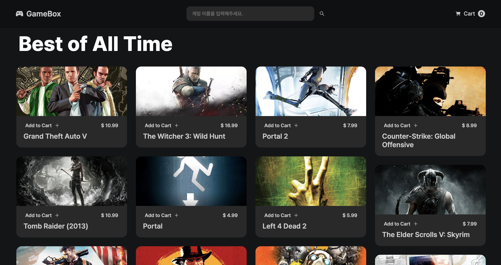
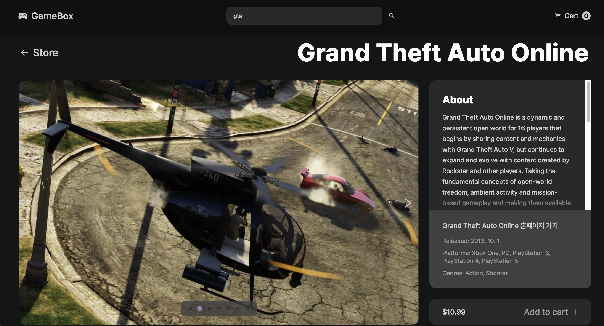
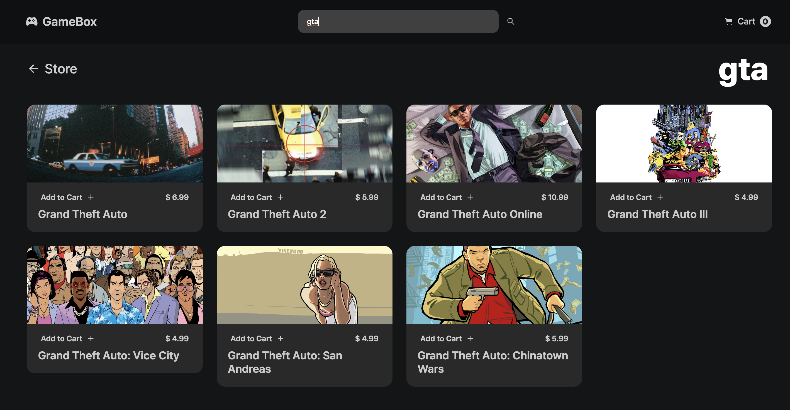
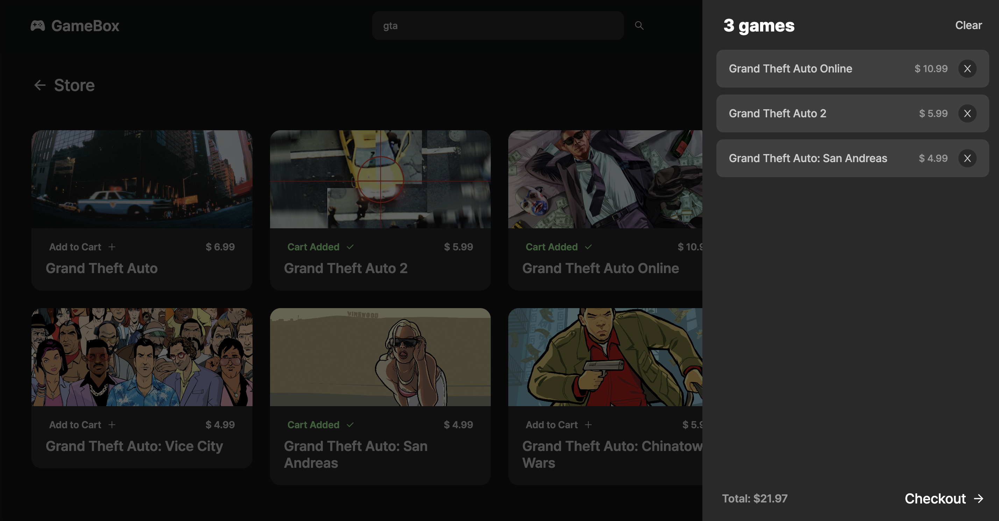
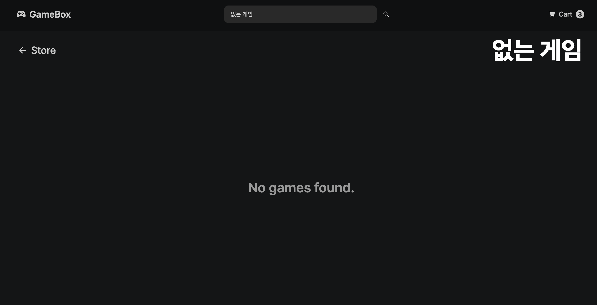

# RAWG API 게임스토어

 

## 🧲 Stacks

      
 

## 💻 Repo소개

RAWG API를 활용한 스팀게임 소개 웹앱

 

## 🔗 배포 / 트러블슈팅 블로깅 링크

배포링크 : https://thisgame.netlify.app/
 
 
회고 / 트러블슈팅 링크 1 :  https://jhbljs92.tistory.com/entry/RAWG-API-%EC%82%AC%EC%9A%A9-store-%EB%A6%AC%ED%8C%A9%ED%86%A0%EB%A7%81%EC%B5%9C%EC%A0%81%ED%99%94-1,
 
회고 / 트러블슈팅 링크 2 :  
https://jhbljs92.tistory.com/entry/RAWG-API-%EC%82%AC%EC%9A%A9-store-%EB%A6%AC%ED%8C%A9%ED%86%A0%EB%A7%81%EC%B5%9C%EC%A0%81%ED%99%94-2
 
 

## 🖥️ 실행화면

<html>
<table>
  <tr>
    <th>
      Home 화면
    </th>
    <th>
      List 화면
    </th>
  </tr>
  <tr>
    <td>
       
    </td>
    <td>
       
    </td>
   </tr> 
  <tr>
    <th>
      Detail 화면
    </th>
    <th>
      Search 화면
    </th>
  </tr>
  <tr>
    <td>
       
    </td>
    <td>
       
    </td>
   </tr>
   <tr>
    <th>
      Cart 페이지
    </th> 
    <th>
      NotFound 페이지
    </th>
  </tr>
  <tr>
    <td>

    </td>
    <td>
       
    </td>
  </tr> 
</table>
 

## 🖋️ 주요 기능

<ul>
  <ul>
    <h3>Header</h3>
    <li>로고 GameBox 클릭시 Home페이지로 이동</li>
    <li>SearchBar에 게임입력시 검색된 게임리스트로 이동</li>
    <li>우측 Cart 클릭시 Cart에 추가된 게임 리스트</li>
  </ul>
     
  <ul>
    <h3>Home 페이지</h3>
    <li>전체 게임 중 4개의 랜덤 게임카드 출력 </li>
    <li>게임카드 클릭시 각 게임별 Details 페이지로 이동 </li>
    <li>게임 더보기 버튼 클릭시 List페이지로 이동 </li>
     <h3>List 페이지</h3>
    <li> 카드 이미지 호버시 이미지 확대 </li>
    <li> 카드 내용 호버시 게임플랫폼, 출시일, 장르 보여짐 </li>
    <li> Add To Cart 버튼 클릭시 Cart에 추가</li>
    <li> 게임 제목 클릭시 해당 게임의 Details 페이지로 이동</li>
    <h3>Details 페이지</h3>
     <li>해당 게임의 게임 스크린샷들 Carousel 기능</li>
     <li>홈페이지 가기 버튼 클릭시 해당 게임 공식 홈페이지로 이동</li>
     <li>Add to Cart 버튼 클릭시 Cart에 추가</li>
     <li>상단 Store 버튼 클릭시 List페이지로 이동</li>
     <h3>Cart 페이지</h3>
     <li>Cart에 추가된 게임의 제목, 가격 보여짐</li>
     <li>각 게임별 x버튼 클릭시 해당 게임 Cart에서 삭제</li>
     <li>게임 제목 클릭시 해당 게임 Details 페이지로 이동</li>
     <li>Clear 버튼 클릭시 Cart의 모든 게임 삭제</li>
     <h3>Footer</h3>
     <li>깃허브, Api 공식 홈페이지로 이동</li>
  </ul>
  </ul>
  
   
     
  
## ⚙️ Prerequisites
<ul>
<li>react >= 18.2.0</li>
<li>framer-motion >=10.16.4 </li>
<li>axios >= 1.5.0</li>
<li>sass >= 1.68.0</li>
<li>react-router-dom >= 6.16.0</li>
</ul>
